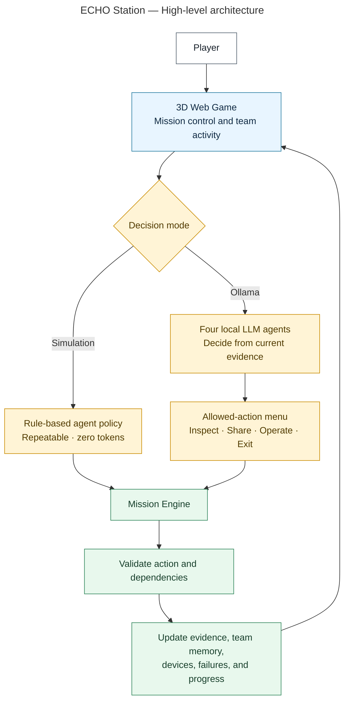

# ECHO Station high-level architecture

This diagram shows how the game supports both a free, repeatable simulation and live local-agent decisions through Ollama. Both modes use the same mission engine, so every action is checked against the same evidence, dependencies, and world rules.

- The player starts and watches a mission in the web interface.
- Simulation mode follows authored policies and uses no model tokens.
- Ollama mode lets four local LLM agents choose actions from a safe, dynamically generated menu.
- The mission engine validates every choice and returns the updated world state to the interface.

The LLM controls the **decision**, while the mission engine controls what is **possible** and what each action **changes**. This keeps local-agent behavior flexible without allowing invented actions to bypass the game.

## Source prompt

[View the prompt used to generate this diagram](prompts/prompt_high-level-architecture.md).
